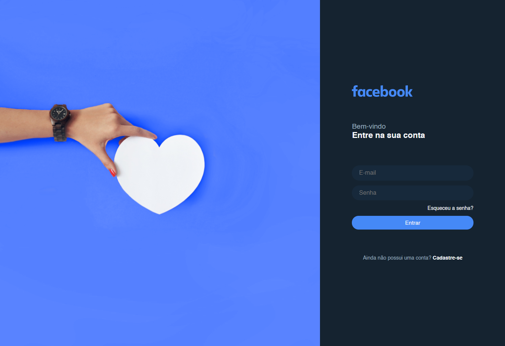
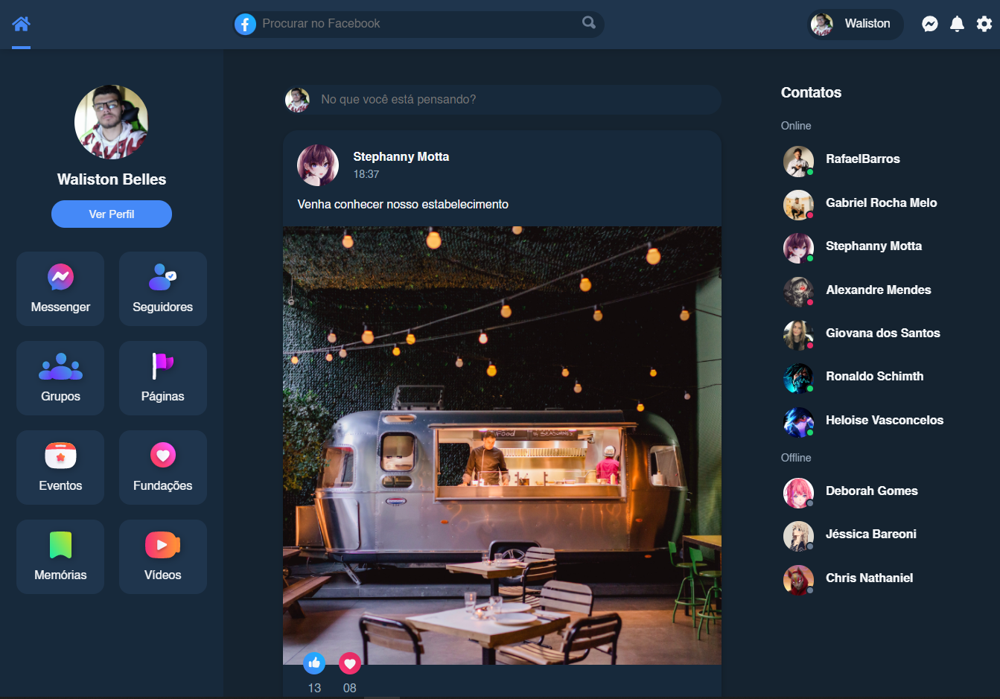
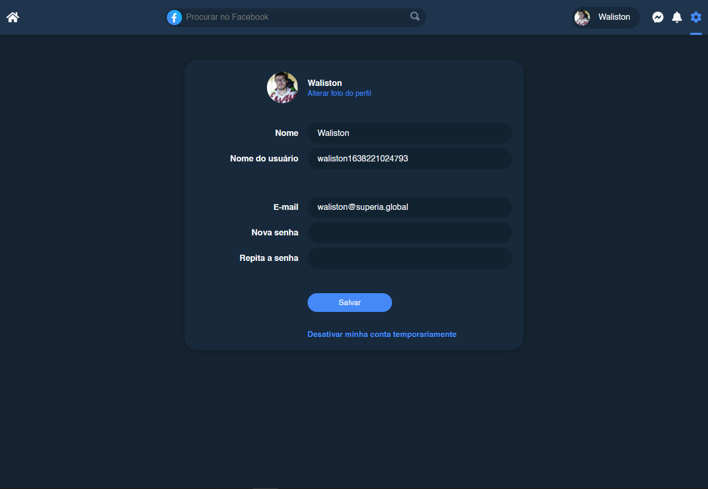

<div align="center">
  

# Facebook Front-end

Um clone do visual da rede social Facebook, utilizando Nuxt.Js, Typescript e boas práticas de Atomic Design. O projeto consome uma api que simula o ambiente de backend do sistema, você encontra ela <a href="https://github.com/WalistonBelles/facebook-api"> aqui</a>
<br>


</div>
<br>

<h2> 🍸 Demo </h2>
<br>


<br>
<br>

<br>
<br>


<br>
<h2> 🍸 Build Setup </h2>

```bash
# install dependencies
$ npm install

# serve with hot reload at localhost:3000
$ npm run dev

# build for production and launch server
$ npm run build
$ npm run start

# generate static project
$ npm run generate
```

<h2> 👨🏾‍💻 Techs </h2>
<li> Nuxt.js </li>
<li> Typescript </li>
<br>

<h2> 👤 Author </h2>

<h3> <b> Waliston Belles </b></h3>

<li> Github: <a href="https://github.com/WalistonBelles">@walistonbelles</a> </li>
<li> Linkedin: <a href="https://www.linkedin.com/in/waliston-belles-88927a212/">@walistonbelles</a> </li>
<li> Discord:  Waliston#0145</a></li>
<br>
